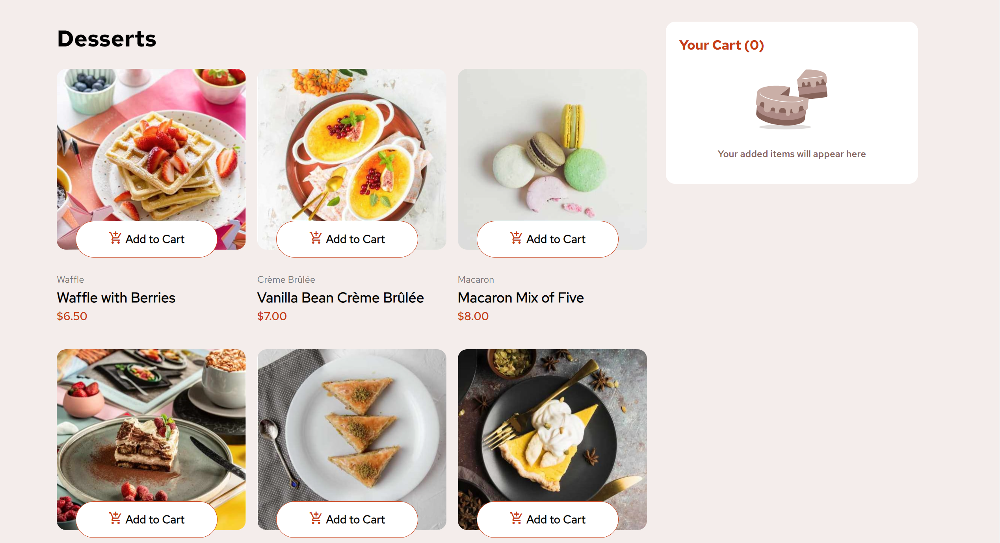

# Frontend Mentor - Product list with cart solution

This is a solution to the [Product list with cart challenge on Frontend Mentor](https://www.frontendmentor.io/challenges/product-list-with-cart-5MmqLVAp_d). Frontend Mentor challenges help you improve your coding skills by building realistic projects.

## Table of contents

- [Overview](#overview)
  - [The challenge](#the-challenge)
  - [Screenshot](#screenshot)
  - [Links](#links)
- [My process](#my-process)
  - [Built with](#built-with)
  - [What I learned](#what-i-learned)
  - [Continued development](#continued-development)
  - [Useful resources](#useful-resources)
- [Author](#author)

## Overview

### The challenge

Users should be able to:

- Add items to the cart and remove them
- Increase/decrease the number of items in the cart
- See an order confirmation modal when they click "Confirm Order"
- Reset their selections when they click "Start New Order"
- View the optimal layout for the interface depending on their device's screen size
- See hover and focus states for all interactive elements on the page

### Screenshot

### Links

- Solution URL: [Github](https://github.com/elizabethrsotomayor/product-list-with-cart-main)
- Live Site URL: [Product List With Cart Vercel App](https://product-list-with-cart-lime.vercel.app/)

## My process

### Built with

- Semantic HTML5 markup
- CSS custom properties
- Flexbox
- CSS Grid
- Mobile-first workflow

### What I learned

This project taught me about working with the DOM and Document Fragments. I began the project with creating the HTML markup and styling the grid as seen on the desktop layout. The Fragment is used twice in the app, once to populate the cart items and then again to construct the order confirm modal. One issue I ran into when styling the app was making sure the Order Total did not overlap with the items in the cart. This was fixed by using `position: absolute` on the order total. When I was working on the `resetCart()` function, the values for quantity of items added to the cart ended up carrying over so I reset the quantity of each item as it is added to the cart every time the app is reset.

### Continued development

I want to learn more about the difference between NodeLists/Nodes vs. HTML and how to obtain the child Nodes present in a Node (for example, the active class div from the dessert item Node).

### Useful resources

- [MDN createElement](https://developer.mozilla.org/en-US/docs/Web/API/Document/createElement) - This helped me figure out how to create an HTML element to add to the DocumentFragment that populates the cart.
- [StackOverflow Remove elements in Fragment after append](https://stackoverflow.com/questions/39704614/how-to-remove-elements-in-document-fragment-after-append) - I used this method to remove both the items and dividers from the cart in the `resetCart()` function.

## Author

- Website - [Elizabeth Sotomayor](https://elizabethsotomayor.vercel.app/)
- Frontend Mentor - [@elizabethrsotomayor](https://www.frontendmentor.io/profile/elizabethrsotomayor)
- LinkedIn - [Elizabeth Rose Sotomayor](https://www.linkedin.com/in/elizabeth-rose-sotomayor/)
